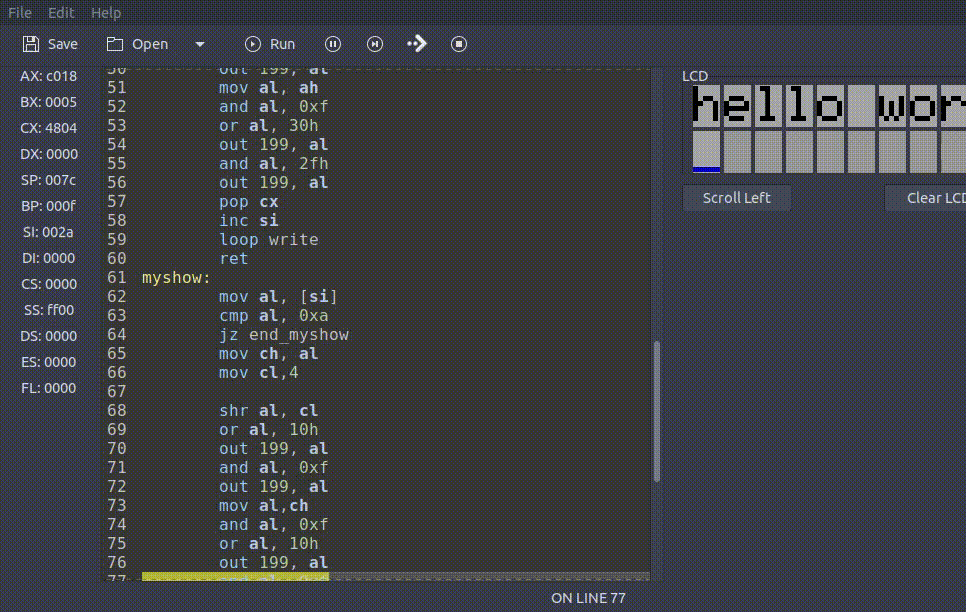

# Gtkmu8086 Plugins

Some gtkemu8086 plugins

## LCD Plugin

Inserts an lcd screen on the left tray
### Demo

## Requirements

- python3
- libpeas
- [gtkemu8086](https://github.com/kosiken/gtkemu8086)
